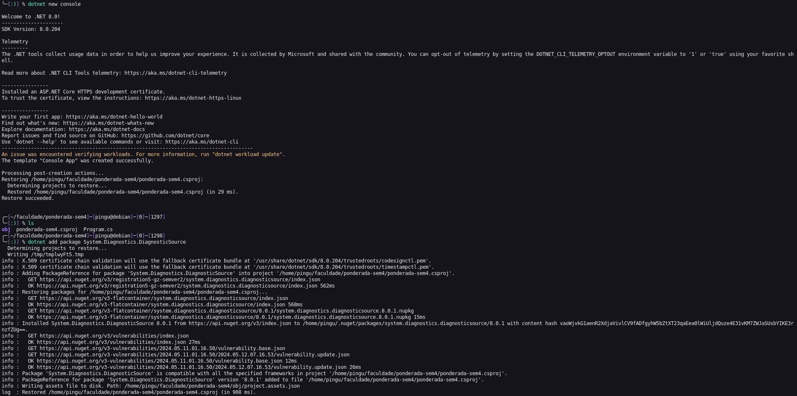

# Criando metricas

## Introdução

O objetivo desta atividade é entender a importância de criar métricas para avaliar o desempenho de uma aplicação. Este documento apresenta um tutorial baseado neste artigo:
https://learn.microsoft.com/pt-br/dotnet/core/diagnostics/metrics-instrumentation

## Pré-requisitos

Antes de começar, é necessário instalar o SDK do .NET Core 6, ou uma versão posterior. 

Instalação: https://dotnet.microsoft.com/en-us/download/dotnet

## Criando um projeto

Para criar um projeto, execute os comandos abaixo:

```bash
dotnet new console
dotnet add package System.Diagnostics.DiagnosticSource
```



Em seguida, adicione o código abaixo no arquivo Program.cs:

```csharp
using System;
using System.Diagnostics.Metrics;
using System.Threading;

class Program
{
    static Meter s_meter = new Meter("HatCo.Store");
    static Counter<int> s_hatsSold = s_meter.CreateCounter<int>("hatco.store.hats_sold");

    static void Main(string[] args)
    {
        Console.WriteLine("Press any key to exit");
        while(!Console.KeyAvailable)
        {
            // Pretend our store has a transaction each second that sells 4 hats
            Thread.Sleep(1000);
            s_hatsSold.Add(4);
        }
    }
}
```

Deixe o programa rodando por alguns segundos, as métricas serão exibidas a seguir.

```bash
dotnet run
```
## Exibindo métricas

Neste tutorial, usaremos a ferramenta dotnet-counters para exibir as métricas. Para instalar, execute o comando abaixo:

```bash
dotnet tool update -g dotnet-counters
```
Enquanto o programa está rodando, execute o seguinte comando: 

```bash
dotnet-counters monitor -n metric-demo.exe --counters HatCo.Store
```
